[](https://confluence.jetbrains.com/display/ALL/JetBrains+on+GitHub)

# Using Jupyter notebook in PyCharm

## Before you start
Prior to executing the tasks of this tutorial, make sure that the following prerequisites are met:

* You have a Python project already created. 
In this tutorial the project `C:/SampleProjects/py/JupyterNotebookExample` is used.

* In the Project Interpreter page of the **Settings/Preferences** dialog, you have:

  * Created a [virtual environment](https://www.jetbrains.com/help/pycharm/creating-virtual-environment.html). For this tutorial a virtual environment based on Python 3.6 has been created.

  * [Installed the following packages](https://www.jetbrains.com/help/pycharm/installing-uninstalling-and-upgrading-packages.html):
       * jupyter
       * matplotlib
       * sympy

Note that PyCharm automatically installs the dependencies of these packages.

## Creating a Jupyter Notebook file 

In the **Project Tool Window**, click `Alt+Insert` (Windows) or `⌘N` (macOS). 
Then, on the pop-up menu that appears, choose the option **Jupyter Notebook** and type the file name (here it is 
`MatplotlibExample.ipynb`).

The newly created file now shows up in the **Project Tool Window** and automatically opens for 
editing.

By now, the new file is empty, but PyCharm recognizes it as a notebook file. 
As such, this file is marked with the icon Jupyter notebook icon 
() and features a toolbar, 
which is a complete replica of the real Jupyter Notebook toolbar:

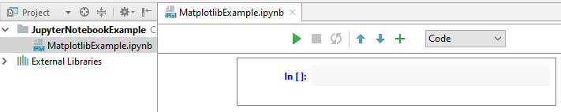

## Filling in and running the first cell
This is most easy. Just click the first cell and start typing. For example, in the very first cell type the following code to configure the matplotlib package:

`%matplotlib inline`

Next, click the icon run cell icon  to run the cell (alternatively, you can press `Shift+Enter` on Windows or `⇧⏎` on macOS). 
PyCharm shows a dialog box, where you have to specify the URL where the Jupyter Notebook server will run:

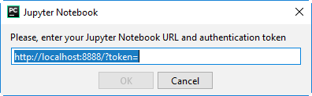

In this dialog box, click **Cancel**, and then click the **Run Jupyter Notebook** link:

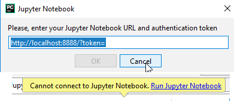

Next, if you didn't install the Jupyter Notebook package yet, the **Run/Debug Configuration** dialog appears showing the 
error message: 

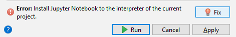

Install the package to fix the problem.
Jupyter server runs in the console:

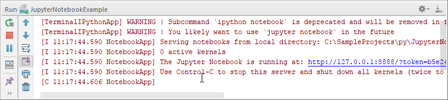
 
Follow this address:

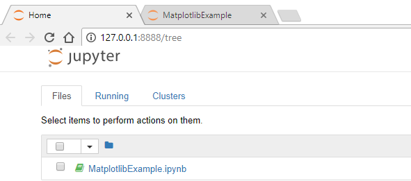

From now on you are ready to work with the notebook integration.

## Working with cells

First of all, add the following import statement:

`from pylab import *`

This how it's done. To create the next empty cell, click  on the 
toolbar:

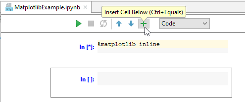

Start typing in this cell, and notice code completion:

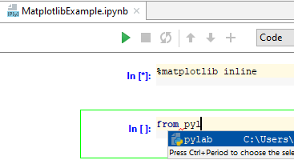

Click **Run a cell** () on the toolbar again to 
run this cell. Note that the cell produces no output, but the next empty cell is created automatically. 
In this new cell, enter the following code:

```
figure()
plot(x, y, 'r')
xlabel('x')
ylabel('y')
title('title')
show()
```
Run this cell. Oops! The attempt to run results in an error:

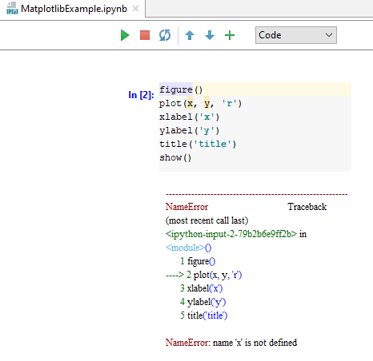

It seems that the variables should be defined first. To do that, add a new cell.

### Adding

Since the new cell is added below the current one, click the cell with import statement - its frame becomes green.
Then on the toolbar click  (or press `Alt+Insert` for Windows
or `⌃N` for macOS) .

In the created cell, type the import statements and run them:

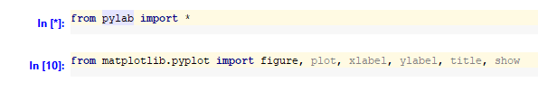

The new cell is created automalically. In this cell, type the following code that will define `x` and `y` 
variables:

```
x = linspace(0, 5, 10)
y = x ** 2
```

Run this cell, and then run the next one. This time it shows the expected output:

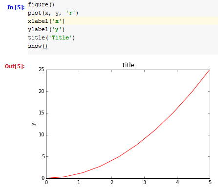

### Running and stopping kernels

As you've already learnt,  is used to execute a cell.

If calculation of a certain cell takes too much time, you can always stop it. To do that, click Stop the 
execution  on the document toolbar.

Finally, you can rerun the kernel by clicking 
on the document toolbar.

The messages about all these actions show up in the console: 

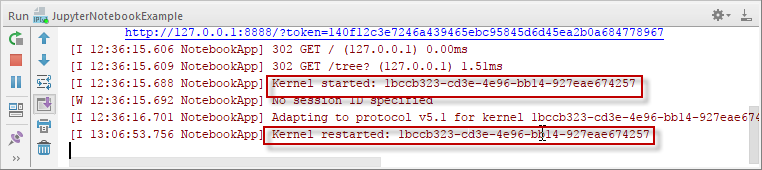

### Choosing style

Look at the drop-down list to the right of the document toolbar. It allows you to choose presentation style of a cell. 
For example, the existing cells are presented as code.

Click the cell with the import statement again, and then click . 
The new cell appears below. By default, its style selector shows **Code**. In this cell, type the following text:

`plot example`

Run this cell and see the error message. Next, click the down arrow, and choose Markdown from the list. 
The cell changes its view:

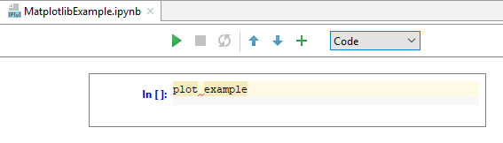

You can just select the desired style from the drop-down list, and the view of the cell changes appropriately:

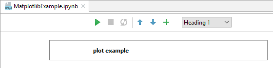

## Writing formulae

Add a new cell. In this cell, choose Markdown from the style selector, and type the following text:

Click . The result is stunning:


As you see, PyCharm's Jupyter Notebook integration makes it possible to use [LaTex](https://en.wikibooks.org/wiki/LaTeX/Mathematics) notation and render formulae, labels and text.

Next, explore the more complicated case. The expected result - the formula - should appear as the result of calculation. 
Add a cell and type the following code (taken from [SymPy](http://nbviewer.ipython.org/github/ipython/ipython/blob/2.x/examples/Notebook/SymPy.ipynb): Open Source Symbolic Mathematics):

```
from __future__ import division
from IPython.display import display

from sympy.interactive import printing
printing.init_printing(use_latex='mathjax')

import sympy as sym
from sympy import *
x, y, z = symbols("x y z")
k, m, n = symbols("k m n", integer=True)
f, g, h = map(Function, 'fgh')
```

Run this cell. It gives no output. Next, add another cell and type the following:

`Rational(3,2)*pi + exp(I*x) / (x**2 + y)`

Now execute the cell and preview the result:

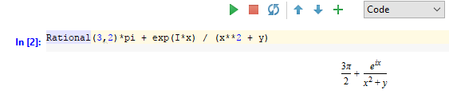 


[a virtual environment]: https://www.jetbrains.com/help/pycharm/creating-virtual-environment.html
